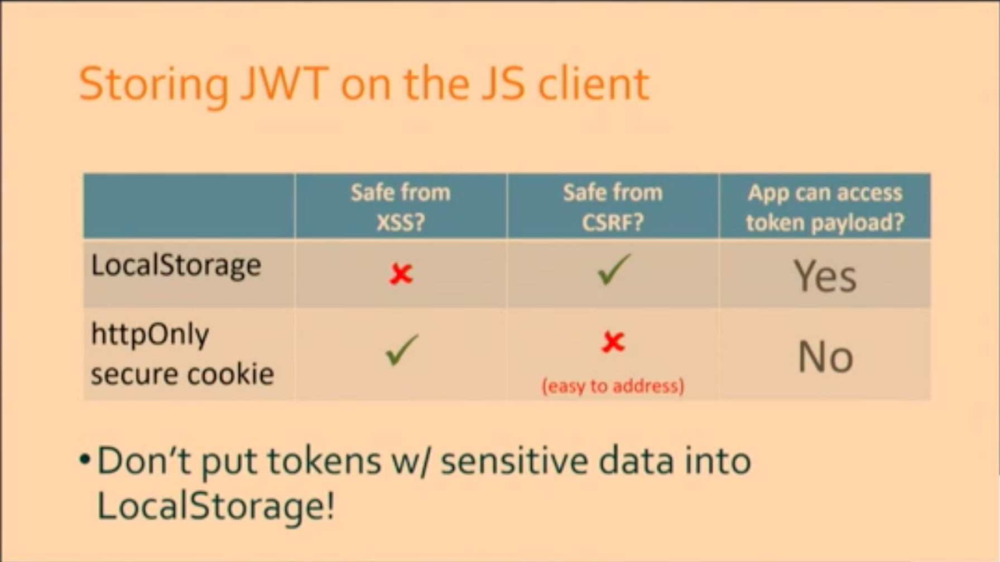
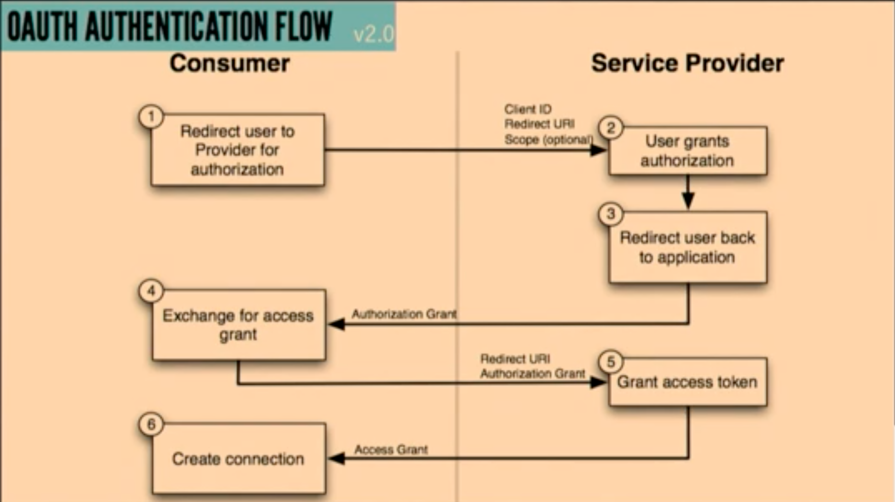

# [Securing Your API Endpoints - A Practical Authentication Guide](https://app.pluralsight.com/player?course=codemash-session-40&author=codemash-conference&name=7532cc0a-3125-4f64-a025-b59c60844644&clip=0&mode=live)

- Seth Petry-Johnson, CodeMash 2020
- Goal: Provide a straightforward guide to authentication with APIs.
- Identity vs. Authentication vs. Authorization
  - Identity: User data
    - Your app's concept of a user.
  - Authentication: Which user is this request for?
    - How we securely associate an identity to a request.
    - Who is making the request?
  - Authorization: Is this request permitted?
    - How we validate the identity's permission do to the request.
- Authentication, in order of increasing complexity
  - Built-in to webserver
    - Overview
      - These can work for simple use cases, though they lack flexibility and can involve sending credentials over the network.
    - Types
      - Client certificates
        - Reverse TLS
          - With TLS, there's a certificate on the server that proves its identity to the browser.
          - You install your certificate on the browser, and this proves your identity to the server.
          - Drawback
            - All users have to install the certificate.
            - With Windows, it's only a 'simple' approach when using Active Directory.
          - Best suited for internal tools.
      - Basic auth
        - HTTP basic authentication.
        - A username and password are concatenated, base64 encoded, and set with each request.
        - The server receives these, parses them, and uses them to authenticate.
        - Encoded does _not_ mean encrypted. So they're essentially sent as plain text.
        - You must use TLS. And you're only as secure as the network's encryption.
        - Note that this uses the `Authorization` header, even though we're dealing with *authentication* (who).
        - With Active Directory, it's supported out of the box with IIS.
        - Easily authenticate against a custom database with a small amount of custom code.
        - Drawbacks:
          - This couples the primary account password to every request.
            - If the user changes their password, this affects all the APIs.
            - Users may be reusing their credentials across sites.
          - Credentials are passed as clear text.
            - This requires using TLS on every request.
      - Digest auth
        - The password is never sent over the network.
        - The client makes a secure request. The server responds with a `401 Unauthenticated` respond and includes a nonce (number used once - random string).
        - The client takes the username and password, concatenates them with the nonce, and creates and MD5 hash.
        - The client resubmits the request, passing the following in clear text: username, nonce, MD5 hash
        - Server looks up the user's password, recomputes the hash, then compares the hashes.
        - Easily integrates with other standards-based systems.
        - TLS is not required (because password is not sent).
        - Drawbacks
          - MD5 has been cracked.
          - In order for this to work, it prevents a password with strong encryption: The server needs to be able to access the plaintext password (rather than using a salted, hashed, one-way encrypted password).
        - So no one really uses digest.
  - Custom
    - Overview
      - Allows more flexibility.
    - Types
      - API keys
        - it's generally more secure and flexible to use something *other than* the primary account credentials.
        - There's no specific standard as to what constitutes an API key.
          - Needs to be unique and difficult to brute force.
        - They must be assigned (not chosen) so they're unique.
        - 2 ways to use it:
          - Bearer token
            - Treat it like a password, passing it over the wire with every request.
            - Anyone who has the key can use it: There's no additional restriction.
            - Must use TLS (because it's being passed as plain text).
            - Easy to pass as a query string. Generally, better to send as a header (because headers don't tend to show up in log files or error reports). And a header can't be leaked by accident (e.g., by copying the link).
            - Tradeoff:
              - You can *either* have secure storage of the API keys in your database *or* the ability to show users a list of their keys. Not both.
                - So they should be salted/hashed when stored. So then you can't show the keys to the user. If you *do* show the users their keys, considering an expiration policy.
          - Cryptographic keys (HMAC)
            - Basically a custom version of digest authentication: Using the key to sign the request.
            - The client sends the signature (request + secret, hashed via SHA1 or SHA256) in a header.
            - MAC: message authentication code
              - HMAC: Hash-based message authentication code
                - using the key to create a hash, sending the hash, and having the server recreate the hash.
            - Benefits
              - Credentials are not being sent over the wire.
              - The server knows the message contents were not changes in transit.
                - Because if it was changed, the hash will not match.
            - Drawbacks
              - Complexity: The client and server must compute the hash in exactly the same way.
                - Example: CanonicalizedAmzHeaders Process.
                  - Preparing the request before you hash it: Canonicalization
                  - What headers will you use? How will they be combined?
              - The request must include a signature and an identifer. The identity indicator is used so the server can look up the key.
                - The username or email address could be used, but this makes it difficult to support multiple API keys per user.
                - A better approach is to issue API keys as a pair: A public key sent over the wire (an identifer), and a private key that's used for hashing.
                - The API key must be stored in plain text, or the server is unable to use it for creating and comparing the hash.
              - How does the client come to know the key in the first place, without exposing it?
                - Anything you expose to JavaScript is basically open for inspection. So you can't store it in the client.
      - JWT
        - JWT are an open, industry standard for securely representing claims between two parties.
          - Claim: Some piece of data
          - Once the claims are generated, the server can cryptographically sign these (creating a token), give the token to the browser, and the browser can then send the token with every request.
        - So the user needs to have a credential, allowing them to log in.
          - Once the user has logged in, the server creates a JSON document of the users claims.
          - using a secret key known only to the server, these claims are combined with the key and hashed: a signature.
          - The claims are then sent with the signature: a token.
          - The client sends the token with each request.
          - Upon receiving a request, the token extracts the claims, recomputes the signature, and verifies that the token matches.
          - Only the server knows the secret key. The client just stores the token and passes it back with each request.
        - Format: `<header>.<payload>.<signature>`
          - Header indicates the type fo token and the hashing algorithm was used. Part of the JWT standard is that the client is able to use the hashing algorithm. This is also one of the reasons why some security experts don't like JWT.

            ```json
            {
                "alg": "HS256",
                "typ": "JWT"
            }
            ```

        - Payload: The claims you're making.
          - If you use the registered claims, they're more interoperable (and can be used for third-party systems, without needing to publish the schema).
        - Signature: Calculated by combining the header and payload together and running these through the hash.
      - JWT tokens are self-contained and stateless.
        - The claim indicates whether the user can do the request. If the server validates the claim, the server doesn't need to look up the user's permissions. Removing this lookup step can help performance.
        - Note that the token is *encoded*, not *encrypted*. So it could be unencoded. Claims are visible to the client.
        - Don't put tokens with sensitive data into LocalStorage!
          - 
            - LocalStorage
              - Advantage
                - Your JS code can access the claims and can use them.
              - Disadvantage
                - LocalStorage is vulnerable to XSS, so you don't want to include things like medical information, Social Security Number, etc.
            - HttpOnly secure cookie:
              - Safe from XSS.
              - But it can only be used for server-side authentication and authorization.
  - OAuth
    - Overview
      - OAuth was designed to solve the problem of delegated authorization in a three-party scenario.
        - In a two-party scenario, a client uses its credentials to access its data on a server.
        - In a three-party scenario, the client is acting on behalf of someone else. The client is not accessing its own resources, but those of the end user.
          - But what if you don't trust the client with your credentials?
          - Parties:
            - Resource owner (owns the content)
            - Service provider (hosting the content)
            - Client (accesses the content)
          - OAuth allows the resource owner to authorize the client to make an *authorized* but *not authenticated* request to the service provider.
          - 
        - 2 versions of OAuth. It's not universally accepted that the new version is better.
      - OAuth is a standard for delegating authorization.
        - OAuth is *not an **authentication** protocol*. It should not be used to figure out *who* is making a request.
          - OAuth tokens do not indicate anything about the user's identity. It can only tell us whether the request is allowed.
          - What if the token lets you call an API that returns identity information? Is this sufficient for authentication? No, there's no guarantee regarding the identity of who made that request.
            - So an interceptor would reuse the token (and identity information) it had gotten earlier.
            - OAuth tokens do not have audience restriction.
            - Do not use any data that can be retrieved from an authorized API call as proof of identity.
    - Types
      - OAuth 1.0/2.0
        - 1.0
          - Uses signed requests.
          - Does not send credentials over the wire.
          - Message integrity is guaranteed.
          - Works best with web-based clients only (because the redirect is, by definition, a Web-based flow).
          - Drawback: Complex
        - 2.0
          - Designed to be simpler and to support non-Web clients.
          - Uses bearer tokens, not request signing.
          - Must use TLS.
            - But TLS is your only level of defense. If it's cracked, you're compromised.
          - No ability to verify the message's integrity.
            - Though TLS can provide this, as long as it's not cracked.
          - Drawbacks
            - A *framework*, not a *protocol*.
              - To support a wide range of workflows, this is left up to the implementer.
              - 1.0 and 2.0 are not interoperable. 2.0 can be implemented differently from case-to-case.
            - Eran Hammer (former lead author of OAuth working group: withdrew his name from the spec prior to publishing 2.0):
              - "When compared with OAuth 1.0, the 2.0 specification is more complex, less interoperable, less useful, more incomplete and, most importantly, less secure."
              - "If you consider yourself a security expert, use 2.0 after careful examination of its features. If you are not an expert, copy an implementation of a provider you trust... or make sure you have some security experts on site to figure it out for you."
      - OpenID Connect
        - An ID standard build on top of OAuth 2.0.
        - Enables authentication against 3rd party identity providers (by closing the gaps in OAuth)
          - Unlike OAuth access tokens, the OpenID Connect tokens have a defined format.
          - This is the best way to log in with Google (for example) in your app.
  - Enterprisey stuff
    - Overview
    - Types
      - SAML
        - Security Assertion Markup Language
        - Older, more complex than JWT.
        - Commonly used for SSO (though JWT usage is increasing here also).
      - WS-Security
        - The king of complexity.
        - If you need enterprise-grade API security, pay someone to help you.
- What should you use?
  - It depends.
    - Client certificates
      - You have to install them.
      - Good for private API use.
      - Not great for open Internet use.
    - HTTP basic auth
      - Good for server-to-server calls, authenticating against a standard database (e.g., ActiveDirectory).
    - HTTP digest auth
      - Don't use it.
    - API keys as bearer tokens
      - Easy to implement.
      - But you're relying on the network-level security. So it's better for when simplicity is more important that security
    - API keys with signed requests
      - Good for when you need more security than with bearer tokens.
      - You need to thoroughly document the signing (hashing) process.
    - JSON Web Tokens
      - Good for a JavaScript client.
      - Provide a stateless alternative to in-memory "session"
      - Can be used for lightweight SSO.
    - OAuth 1.0
      - Provides delegated access to user data.
      - Good for Web-based use cases.
      - Provides high security, but at the cost of complexity.
    - OAuth 2.0
      - Enables a wider set of flows.
      - Simpler than 1.0.
      - Avoids complexity of signing.
      - But less interoperable.
    - OAuth 2.0 + OpenID Connect
      - When you want to *authenticate* against third-party data.
    - SAML or WS-Security
      - Only if you need it.
- 3 key take-aways:
  1. Use API keys as **bearer tokens** (easier) or to **sign requests** (more secure)
  2. **JSON Web Tokens** are a secure, statelsss way to share *non-sensitive data*. Careful about XSS/CRSF!
  3. **OAuth is for authorization, not authentication.** Use OpenID Connect if you need both.
